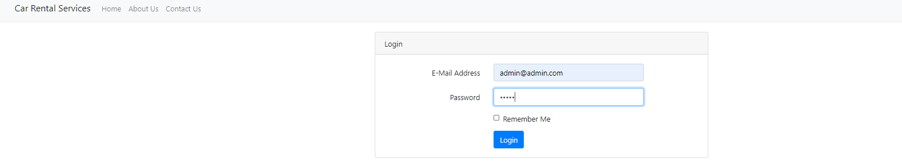
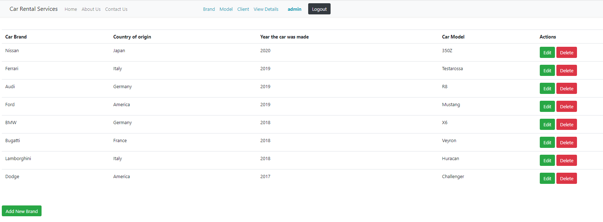
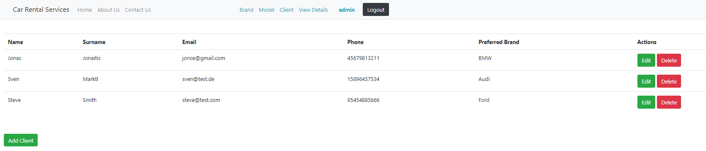
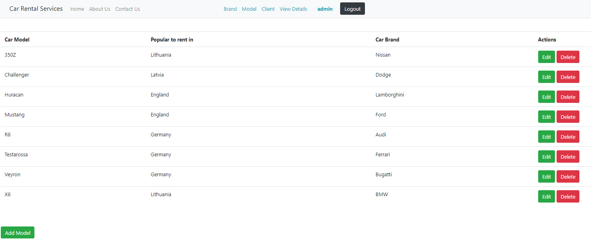
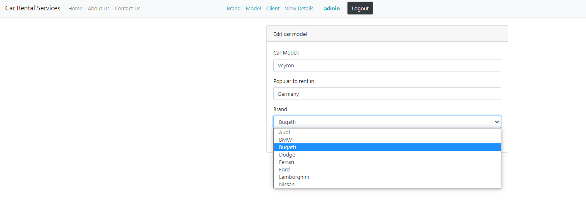

# Car Rental Services project

A simple Laravel CRUD based app used for managing Car Rental Services.
___
<br>

## Features

 :heavy_check_mark: Admin's Login Page <br>
 :heavy_check_mark: Creating Client/Car <br>
 :heavy_check_mark: Deleting Client/Car <br>
 :heavy_check_mark: Updating Client/Car <br> 
 :heavy_check_mark: Database <br> 
 ___
<br>

## Installation

- In order to run the project you need to have AMPPS and database managing application installed (MySQL Workbench preferred).
- If you have them just navigate to the main page of the repository and download or clone the project (.zip file).
- Import file ("../database/schema/laravel-sprint5.sql") into MySQL Workbench in order to be able to use the existing database schema.
- Open the terminal in projects root directory and type "composer install" or "php composer.phar install" (it depends if you have it installed globally or not).
- Navigate to **.env** file and set the correct database name and your password.
- Run the database migrations.
```bash
php artisan migrate
```
- In the terminal run php artisan serve.
___
<br>

## Usage

- Turn on Your AMPPS(needed for MySQL).
- Find and copy the server uri specified in the terminal(after the "php artisan serve" command). Paste it to your browser.
- In order to login type **login** as a basename <br>

</br>
- Use this email and password to login:

```bash
email: admin@admin.com
password: admin

```
___
</br>

## Screenshots
<div>

<br>

<br>

<br>

</div>

</div>

___